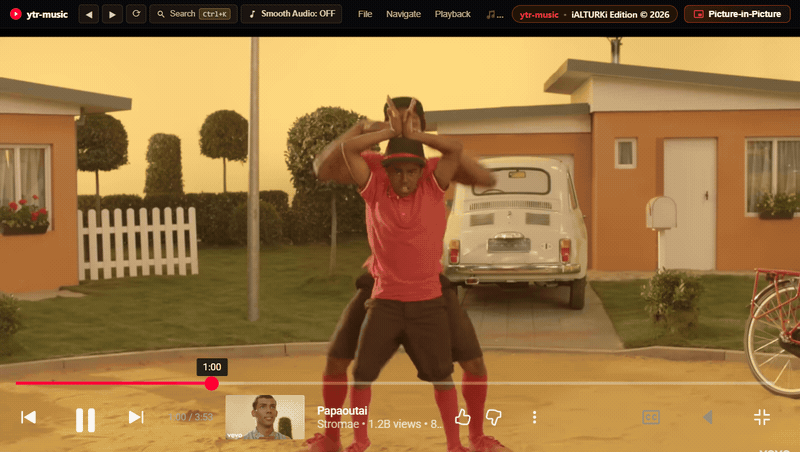
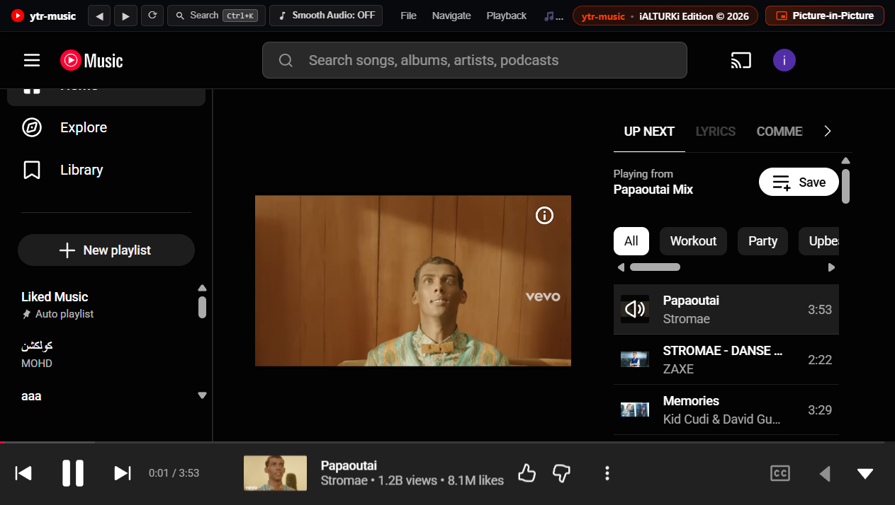
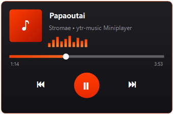
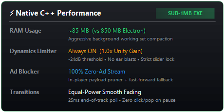

# ytr-music

🎵 A blisteringly fast, 100% ad-free desktop music client for Windows built with a pure C++ Win32 engine, background dynamic audio limiter, zero-latency audio transitions, and an interactive glass miniplayer. One self-contained client, zero clutter, no ads.

[](https://github.com/iAlturki/ytr-music/releases/latest/download/ytr-music.exe)



| Clean Ad-Free Player | Glass Desktop Miniplayer | Native Speed & Dynamic Limiter |
|:-:|:-:|:-:|
|  |  |  |

## What's new in 4.0

- **Pure C++ Win32 Native Engine** – sub-1MB binary footprint, instant startup, and <90MB RAM working set compaction replacing heavy runtimes.
- **100% Ad-Free Audio Engine** – in-player JSON payload pruner + network domain blocker. Zero audio ads, zero video ads, zero interruptions.
- **Background Dynamics Limiter & Ear Protection** – automatic transparent leveling (`-24 dB` threshold, `5:1` ratio) at strict `1.0x` unity gain. Eliminates deafening volume spikes while strictly preserving user volume slider fidelity.
- **Desktop Glass Miniplayer** – vertical right-docked widget floating above the taskbar with album art, animated EQ bars, interactive seek scrubber, wheel volume, and global shortcut toggle (`Ctrl+Alt+M`).
- **Equal-Power Smooth Audio Fades** – continuous logarithmic volume curves across pause, resume, and track skips with 25ms end-of-track polling.

## Features

- **Pure Native Speed** – Built with modern C++17 and the lightweight Windows WebView2 Evergreen runtime. Under 400 KB executable size with hardware-accelerated rendering and background RAM compaction.
- **Always-On Ear Protection** – Dynamics limiter operates headless in the background without UI clutter, clamping sudden loud audio peaks while strictly honoring your volume slider level.
- **Zero Ads, Zero Telemetry** – Strips ad slots and tracking payloads before playback initialization, with microsecond auto-skip fallback.
- **Glass Acrylic Miniplayer** – Hover-expanding miniplayer with real-time waveform EQ, interactive progress scrubbing, track skipping, and right-click context menu.
- **Global Hotkeys & Media Keys**
  - `Ctrl + Alt + M` – Toggle Desktop Glass Miniplayer
  - `Ctrl + Alt + Space` / `Media Play/Pause` – Play / Pause
  - `Ctrl + Alt + Right` / `Media Next` – Next Track
  - `Ctrl + Alt + Left` / `Media Prev` – Previous Track
  - `Mouse Wheel` over Miniplayer – Adjust Volume
- **System Tray Integration** – Seamless minimize-to-tray with live song info tooltips and instant wake.

## Quick Start

### Portable Run (No installation needed)
1. Download **[`ytr-music.exe`](https://github.com/iAlturki/ytr-music/releases/latest/download/ytr-music.exe)** from the latest release.
2. Run `ytr-music.exe` directly, or double-click **`Run-Native.bat`**.

### Building from Source
```powershell
# Clone the repository
git clone https://github.com/iAlturki/ytr-music.git
cd ytr-music

# Compile the native C++ client with MinGW-W64
cmd.exe /c native\build.bat
```

## Author & License

- **Creator & Sole Rights Holder**: **[iALTURKi](https://github.com/iALTURKi)**
- **Repository**: [github.com/iAlturki/ytr-music](https://github.com/iAlturki/ytr-music)
- **License**: MIT License (see [license](license)). All rights reserved.
